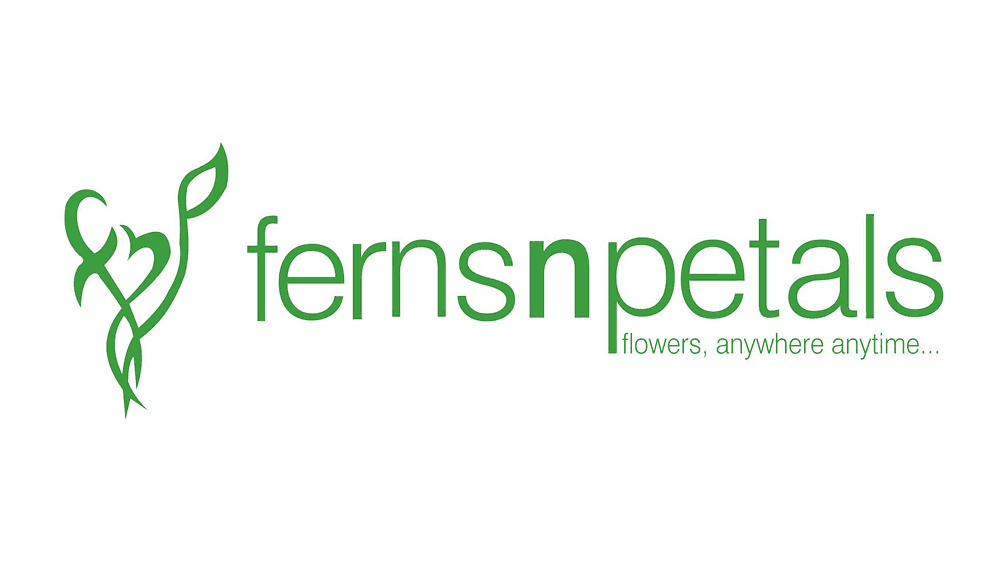

  

<h1 align="center">FNP Sales Performance Analysis</h1>

<table align="center">
  <tr>
    <td width="1440">
      <h2 align="center">Project Background</h2>
      <body>
        <strong>Ferns N Petals (FNP)</strong> is India's leading gifting platform,
        offering flowers, cakes, plants, and personalised gifts for every occasion.
        This project performs an end-to-end analysis of FNP's transactional data
        covering <strong>January–December 2023</strong>.  
        The dataset spans <strong>1,000 orders</strong>, <strong>100 customers</strong>,
        and <strong>70 products</strong> across 7 gifting occasions, generating total
        revenue of <strong>₹35,20,984</strong>. Analysis was conducted across a full
        medallion data pipeline — raw CSV → SQL Server Bronze/Silver/Gold layers →
        Power BI dashboard.  
        The key insights and recommendations focus on the following areas:
      </body>
      <h3>Northstar Metrics</h3>
      <h4>
        <ul>
          <li><strong>Revenue trends</strong> — Monthly performance, occasion-driven spikes, 
          and MoM growth analysis.</li>
          <li><strong>Product performance</strong> — Top products, category concentration, 
          and best product per occasion.</li>
          <li><strong>Customer intelligence</strong> — Segmentation by frequency, retention 
          strength, and spending behavior.</li>
          <li><strong>Operations & delivery</strong> — Delivery time by city and month, 
          peak ordering hours and days.</li>
        </ul>
      </h4>
    </td>
  </tr>
</table>

---

<h2 align="center">Dashboard Preview</h2>

<table align="center">
  <tr>
    <td align="center">
      <h3>Executive Overview</h3>
      
    </td>
  </tr>
  <tr>
    <td align="center">
      <h3>Product & Customer Intelligence</h3>
      
    </td>
  </tr>
  <tr>
    <td align="center">
      <h3>Operations & Delivery</h3>
      
    </td>
  </tr>
</table>

---

<h1 align="center">Executive Summary</h1>

<h3 align="center">Monthly Revenue Analysis (Jan–Dec 2023)</h3>

  

<table align="center">
  <tr>
    <td width="720">
      <ol>
        <li>
          <strong>Extreme Seasonality — 4 Months Drive 75% of Annual Revenue</strong>
          <ul>
            <li>February (₹7.04L) and August (₹7.37L) are the two peak months,
            driven by Valentine's Day + Holi and Raksha Bandhan respectively.</li>
            <li>50% of annual revenue is captured by end of June alone.</li>
            <li>The remaining 8 months average only ₹1.45L each — 
            far below the monthly average of ₹2.93L.</li>
          </ul>
        </li>
        <li>
          <strong>Valentine's Day Is Underperforming</strong>
          <ul>
            <li>Despite being India's #1 gifting occasion, Valentine's Day 
            generates only 9.43% of annual revenue — ranking 6th of 7 occasions.</li>
            <li>Anniversary (19.16%) generates 2x more revenue than Valentine's Day.</li>
            <li>Targeted pre-campaign activity 30 days before Valentine's Day 
            could significantly close this gap.</li>
          </ul>
        </li>
        <li>
          <strong>MoM Performance Shows Cliff-Edge Drops After Peak Occasions</strong>
          <ul>
            <li>February saw a +637.95% MoM spike — the largest of the year.</li>
            <li>September saw a -81.43% MoM drop immediately after Raksha Bandhan.</li>
            <li>No organic baseline growth exists between occasions — 
            every non-peak month sits Below Average.</li>
          </ul>
        </li>
      </ol>
    </td>
  </tr>
</table>

---

<h2 align="center">Data Architecture — Medallion Pipeline</h2>

  

<body>
The database structure consists of three schemas across a medallion architecture,
with a total of 1,000 order records, 70 products, and 100 customers.
</body>

<table align="center">
  <tr>
    <td width="240" valign="top" align="center">
      <h3>🥉 Bronze Layer</h3>
      Raw data ingested as-is from CSV files.
      All columns stored as NVARCHAR.
      No transformations. Audit layer only.
        
      <strong>Tables:</strong> bronze.orders,
      bronze.products, bronze.customers
    </td>
    <td width="240" valign="top" align="center">
      <h3>🥈 Silver Layer</h3>
      Cleaned and typed data. Derived columns
      engineered: delivery_days, order_hour,
      order_day, order_month, revenue.
      Quality filters applied.
        
      <strong>Tables:</strong> silver.orders,
      silver.products, silver.customers
    </td>
    <td width="240" valign="top" align="center">
      <h3>🥇 Gold Layer</h3>
      Star schema for reporting. Dimension
      tables with surrogate keys. Two reporting
      views consolidating all KPIs for
      Power BI consumption.
        
      <strong>Tables:</strong> fact_orders,
      dim_customers, dim_products,
      report_customers, report_products
    </td>
  </tr>
</table>

---

<h1 align="center">Insights Deep Dive</h1>

<table align="center">
  <tr>
    <h2 align="center">Revenue by Occasion</h2>
    <td align="center">
      
    </td>
  </tr>
</table>

<table align="center">
  <tr>
    <td width="480" valign="top">
      <strong>Occasion Concentration</strong>
      <ol>
        <li>Top 4 occasions control 69.07% of total revenue.
          <ul>
            <li>Anniversary: ₹6.74L (19.16%)</li>
            <li>Raksha Bandhan: ₹6.32L (17.94%)</li>
            <li>All Occasions: ₹5.86L (16.65%)</li>
            <li>Holi: ₹5.75L (16.32%)</li>
          </ul>
        </li>
        <li>Raksha Bandhan has the highest AOV at ₹4,784 per order —
        customers spend significantly more per transaction for this occasion.
        </li>
        <li>Valentine's Day ranks 6th despite cultural prominence —
        an underleveraged commercial opportunity.</li>
      </ol>
    </td>
    <td width="480" valign="top">
      <strong>Category Concentration</strong>
      <ol>
        <li>Three categories carry 70.44% of total revenue:
          <ul>
            <li>Colors: ₹10.06L (28.56%)</li>
            <li>Soft Toys: ₹7.41L (21.04%)</li>
            <li>Sweets: ₹7.34L (20.84%)</li>
          </ul>
        </li>
        <li>Colors category wins 3 of 7 occasions —
        the most dominant category across occasions.</li>
        <li>Mugs and Plants together contribute only 11.74% —
        potential for repositioning or bundling strategies.</li>
      </ol>
    </td>
  </tr>
</table>

---

<table align="center">
  <tr>
    <h2 align="center">Product Performance</h2>
    <td align="center">
      
    </td>
  </tr>
</table>

<table align="center">
  <tr>
    <td width="480" valign="top">
      <h3>Best and Worst Performers</h3>
      <ul>
        <li>Magnam Set leads all occasions with ₹1,21,905 in revenue —
        the only product to dominate across all occasion types.</li>
        <li>Soft Toys dominate 2 of 7 occasions
        (All Occasions and Raksha Bandhan).</li>
        <li>Colors products win 3 occasions
        (Holi, Birthday, Valentine's Day).</li>
        <li>Luxury products (₹1500+) generate the most revenue
        at ₹17.7L despite having only 21 SKUs.</li>
      </ul>
    </td>
    <td width="480" valign="top">
      <h3>Price Segment Analysis</h3>
      <ul>
        <li>Luxury (₹1500+): 21 products → ₹17.7L revenue (50.5%)</li>
        <li>Premium (₹1001–₹1500): 19 products → ₹10.3L revenue (29.2%)</li>
        <li>Mid Range (₹500–₹1000): 19 products → ₹5.7L revenue (16.2%)</li>
        <li>Budget (Below ₹500): 11 products → ₹1.4L revenue (4.1%)</li>
        <li>Higher price does not reduce demand —
        Luxury products generate 12x more revenue than Budget.</li>
      </ul>
    </td>
  </tr>
</table>

---

<table align="center">
  <tr>
    <h2 align="center">Customer Intelligence</h2>
    <td align="center">
      
    </td>
  </tr>
</table>

<table align="center">
  <tr>
    <td width="480" valign="top">
      <h3>Retention Strength</h3>
      <ul>
        <li>98% of customers placed 5 or more orders —
        exceptional retention for a gifting platform.</li>
        <li>Only 2 customers placed fewer than 5 orders in the full year.</li>
        <li>50 Regular customers (10–14 orders) generate
        63% of total annual revenue.</li>
        <li>5 Loyal customers (15+ orders) average
        ₹61,993 revenue each — 2.2x the Regular segment average.</li>
      </ul>
    </td>
    <td width="480" valign="top">
      <h3>Spending Behavior</h3>
      <ul>
        <li>Loyal customers have the highest AOV at ₹3,834 per order —
        they spend more per visit AND visit more often.</li>
        <li>Occasional customers (5–9 orders) have higher AOV (₹3,656)
        than Regular customers (₹3,413) — re-engagement could
        convert them to Regular with minimal incentive.</li>
        <li>Male and female customers contribute almost equally
        to total revenue — no gender targeting gap exists.</li>
      </ul>
    </td>
  </tr>
</table>

---

<table align="center">
  <tr>
    <h2 align="center">Operations & Delivery</h2>
    <td align="center">
      
    </td>
  </tr>
</table>

<table align="center">
  <tr>
    <td width="480" valign="top">
      <h3>Delivery Performance</h3>
      <ul>
        <li>Average delivery: 5.53 days across 1,000 orders.</li>
        <li>31.9% of orders take 8+ days — a significant risk
        for occasion-driven gifting where timing is critical.</li>
        <li>Delivery performance holds stable during peak months —
        February (5.59 days) and August (5.70 days) show
        no degradation despite 5-6x order volume.</li>
        <li>September is the surprise weak spot at 6.22 days
        average with only 40 orders — an off-peak operational gap.</li>
      </ul>
    </td>
    <td width="480" valign="top">
      <h3>Time Intelligence</h3>
      <ul>
        <li>60% of orders are placed outside business hours
        (Night 31.4% + Morning 28.6%).</li>
        <li>Sunday is the busiest day — weekend gifting
        decisions drive the business.</li>
        <li>Evening buyers (5pm–8pm) have the highest AOV
        at ₹3,668 despite fewest orders — highest intent segment.</li>
        <li>Friday 1am and Sunday 5pm are the two busiest
        single hour-day combinations of the year.</li>
      </ul>
    </td>
  </tr>
</table>

---

<h1 align="center">Recommendations</h1>

<h4>Based on the uncovered insights, the following actions would 
strengthen FNP's commercial performance:</h4>

<table align="center">
  <tr>
    <td width="720">
      <ul>
        <h3>Revenue & Occasions</h3>
        <li>Launch Valentine's Day campaigns 30 days in advance
        to close the gap with Anniversary revenue.
          <ul>
            <li>Valentine's Day currently generates only 9.43%
            of annual revenue despite being India's #1 gifting occasion.</li>
            <li>Targeted digital campaigns in January could
            add ₹2–3L in incremental February revenue.</li>
          </ul>
        </li>
        <li>Develop non-occasion gifting campaigns to build
        a revenue baseline between peak months.
          <ul>
            <li>8 of 12 months sit Below Average revenue —
            reducing this gap by 20% would add ₹5L annually.</li>
          </ul>
        </li>
        <h3>Products</h3>
        <li>Prioritize Luxury (₹1500+) and Premium (₹1001–₹1500)
        product inventory year-round.
          <ul>
            <li>These two segments generate 79.7% of total revenue
            with only 40 SKUs.</li>
          </ul>
        </li>
        <li>Bundle Mugs and Plants with high-performing categories
        to lift their 11.74% combined revenue share.
        </li>
        <h3>Customers</h3>
        <li>Launch a loyalty program targeting the top 20
        Occasional customers (5–9 orders).
          <ul>
            <li>Converting them to Regular status could add
            ₹4–5L in annual revenue.</li>
            <li>Occasional customers already have AOV of ₹3,656 —
            they just need frequency nudges.</li>
          </ul>
        </li>
        <h3>Operations</h3>
        <li>Investigate and resolve the 31.9% Slow delivery
        rate (8+ days).
          <ul>
            <li>For occasion-driven gifting, late delivery
            directly damages customer satisfaction and repeat purchase intent.</li>
            <li>Reducing Slow deliveries by 50% would move
            ~160 orders to Standard or Fast delivery.</li>
          </ul>
        </li>
        <li>Schedule marketing campaigns for 9pm–11pm Sunday slots.
          <ul>
            <li>60% of orders arrive outside business hours.</li>
            <li>Sunday night is the peak gifting decision window.</li>
          </ul>
        </li>
      </ul>
    </td>
  </tr>
</table>

---

<h2 align="center">SQL Analysis — 15 Scripts</h2>

<table align="center">
  <tr>
    <th>File</th>
    <th>Analysis Type</th>
    <th>Key Output</th>
  </tr>
  <tr><td>01_database_exploration</td><td>Schema exploration</td><td>Table structure and metadata</td></tr>
  <tr><td>02_dimensions_exploration</td><td>Dimension analysis</td><td>Unique occasions, categories, cities</td></tr>
  <tr><td>03_date_range_exploration</td><td>Temporal analysis</td><td>Full year 2023, 0 data gaps</td></tr>
  <tr><td>04_measures_exploration</td><td>KPI summary</td><td>₹35.2L revenue, ₹3,520 AOV</td></tr>
  <tr><td>05_magnitude_analysis</td><td>Revenue by dimension</td><td>Anniversary leads, Colors top category</td></tr>
  <tr><td>06_ranking_analysis</td><td>Top/bottom ranking</td><td>Magnam Set #1, RANK() OVER PARTITION</td></tr>
  <tr><td>07_change_over_time</td><td>Monthly trends</td><td>Feb and Aug peak months</td></tr>
  <tr><td>08_cumulative_analysis</td><td>Running totals</td><td>50% revenue by June</td></tr>
  <tr><td>09_performance_analysis</td><td>MoM growth (LAG)</td><td>Feb +637%, Sep -81%</td></tr>
  <tr><td>10_data_segmentation</td><td>Customer segments</td><td>98% retention rate</td></tr>
  <tr><td>11_part_to_whole</td><td>Revenue contribution %</td><td>Top 3 categories = 70%</td></tr>
  <tr><td>12_delivery_analysis</td><td>Delivery performance</td><td>31.9% slow, Sep worst month</td></tr>
  <tr><td>13_time_intelligence</td><td>Peak hours and days</td><td>60% orders outside business hours</td></tr>
  <tr><td>14_report_customers</td><td>Customer KPI view</td><td>Segment, AOV, recency, spend</td></tr>
  <tr><td>15_report_products</td><td>Product KPI view</td><td>Segment, revenue, monthly performance</td></tr>
</table>

---

<h2 align="center">Tech Stack</h2>

<table align="center">
  <tr>
    <th>Tool</th>
    <th>Purpose</th>
  </tr>
  <tr><td>SQL Server Express</td><td>Data warehouse — medallion architecture</td></tr>
  <tr><td>SSMS</td><td>Database management and query execution</td></tr>
  <tr><td>Power BI Desktop</td><td>Interactive 3-page dashboard</td></tr>
  <tr><td>Excel</td><td>Initial EDA and data profiling</td></tr>
  <tr><td>GitHub</td><td>Version control and portfolio hosting</td></tr>
</table>

---

<h2 align="center">Known Limitations</h2>

<ul>
  <li>Dataset covers 2023 only — no year-over-year comparison possible.</li>
  <li>BULK INSERT replaced by SSMS Import Flat File Wizard due to SQL Server Express
  service account file permission restrictions. Production fix documented in script headers.</li>
  <li>Power BI file requires local SQL Server Express connection to refresh data.</li>
</ul>

---

  <h2>Author</h2>
  <strong>Saswata</strong> — Data Analyst Portfolio Project  
  <a href="YOUR_LINKEDIN_URL">LinkedIn</a> |
  <a href="YOUR_GITHUB_URL">GitHub</a>

